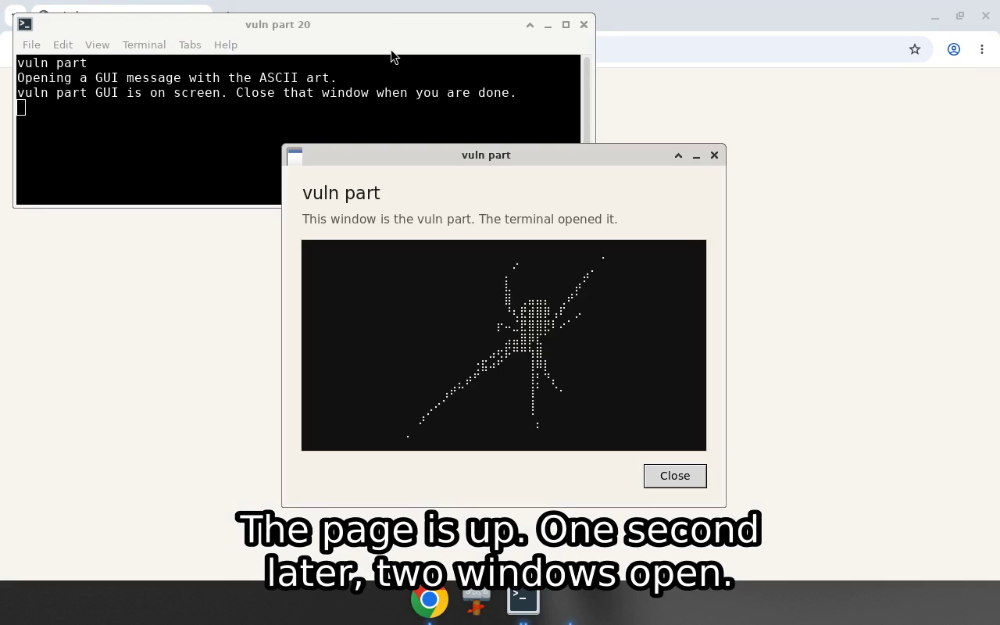

# chrome-page-launch

A quiet little notes page with a loud little secret.

You open what looks like a grocery list. A terminal wakes up. A small dialog steps in, shows the mark, and waits for you to close it. That is the whole trick, and it does the same thing on Linux and Windows.

## Watch the proof

Click the picture. It plays the recorded walkthrough.

[](https://github.com/FREECANDY-DEV/chrome-page-launch/blob/main/docs/poc.mp4)

Play it from the file: [docs/poc.mp4](https://github.com/FREECANDY-DEV/chrome-page-launch/blob/main/docs/poc.mp4)

The captions are burned in, so you can follow it with the sound off. The same lines are in [docs/poc.srt](docs/poc.srt).

What you see:

1. A terminal opens. The address is typed, then `python3 server.py` starts the server.
2. The notes page address is typed in the browser. No shortcut.
3. The page is up. One second later, two windows open: the terminal, then the dialog with the art and Close.

## The one-second pause

The visit waits one second after the page is on screen, then opens the terminal. That beat is `LAUNCH_DELAY_S` at the top of `server.py`.

For full power, set `LAUNCH_DELAY_S` to `0`. The terminal starts the moment the page is requested. No pause.

## What you are looking at

| Piece | What it pretends to be | What it actually does |
| --- | --- | --- |
| `index.html` | A normal kitchen-notes page | The page you visit |
| `server.py` | A tiny local web server | On each visit, opens a terminal and runs the script |
| `show-vuln-art.py` | The script the terminal runs | Opens a dialog that fits the machine it is on |
| `show-vuln-art.bat` | The Windows starter | Same script, from `cmd` |
| `vuln-art.txt` | The drawing | The mark shown in the dialog |

The notes page stays ordinary on purpose. The dialog is the part that announces itself: title, one sentence, the art, Close. On Windows it uses Segoe UI and respects the display scale. On Linux it picks a clean font the machine already has, centers itself, and shrinks the art if the screen is small.

## Run it

You need Python 3. On Windows, a normal Python install is enough. On Linux, install `python3-tk` as well. Linux also wants a terminal it can open (`xfce4-terminal` is what this demo uses).

```bash
python3 server.py
```

Then open [http://127.0.0.1:8765/](http://127.0.0.1:8765/). Type the address. Do not use a shortcut. The page comes up, then the rest follows.

Refresh the page and it happens again. Each visit gets its own terminal and its own dialog.

On Windows, from the same folder:

```bat
python server.py
```

The server starts `show-vuln-art.bat`, which keeps a command window open and runs the script.

## The dialog, in plain terms

It is one window, not a pile of fallbacks you have to babysit.

- It reads the art from `vuln-art.txt`, next to the script.
- It measures the art, then sizes the window so the sentence, the drawing, and Close all fit.
- If the screen is tight, it drops the art size instead of clipping the button.
- Escape or Close dismisses it.
- If the usual window toolkit is missing, Windows falls back to a built-in dialog and Linux falls back to Tcl/Tk. Same look, same job.

## Files

```
index.html          the notes page
opened.html         older companion page, kept for the record
server.py           visit handler
show-vuln-art.py    the dialog
show-vuln-art.bat   Windows launcher
vuln-art.txt        the drawing
docs/poc.mp4        the recorded walkthrough
docs/poc.srt        the subtitle file
docs/walkthrough.png  the picture on this page
```

## A note on taste

This is a local demo. It talks to `127.0.0.1` only. It does not phone home, and it does not try to be clever about the notes page. The fun is the contrast: a bland list, then a window that tells you exactly what just happened.
